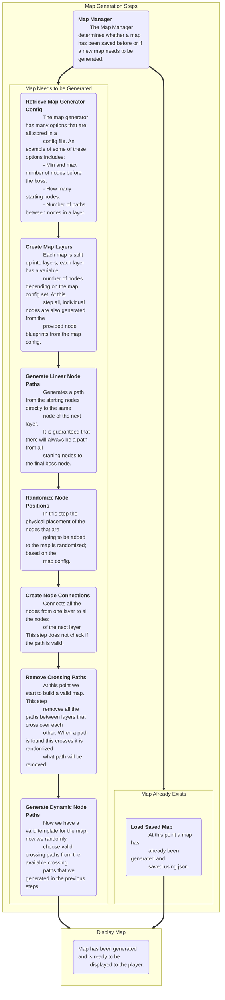

# Map Generation Block Diagram

```mermaid
flowchart TB
    classDef default text-align:left
    subgraph MapGenerationSubgraph[Map Generation Steps]
        direction TB
        MapNode("<b>Map Manager</b>
        The Map Manager determines whether a map has been saved before or if a new map needs to be generated.")
        subgraph MapSavedSubgraph[Map Already Exists]
        direction TB
            LoadSavedMapNode("<b>Load Saved Map</b>
            At this point a map has
            already been generated and
            saved using json.")
        end
        subgraph MapGenerationStepsSubgraph[Map Needs to be Generated]
            direction TB
            GetMapConfigNode("<b>Retrieve Map Generator Config</b>
            The map generator has many options that are all stored in a 
            config file. An example of some of these options includes:
            - Min and max number of nodes before the boss.
            - How many starting nodes.
            - Number of paths between nodes in a layer.")
            MapLayersNode("<b>Create Map Layers</b>
            Each map is split up into layers, each layer has a variable
            number of nodes depending on the map config set. At this
            step all, individual nodes are also generated from the
            provided node blueprints from the map config.")
            GenerateNodePathsNode("<b>Generate Linear Node Paths</b>
            Generates a path from the starting nodes directly to the same
            node of the next layer.
            It is guaranteed that there will always be a path from all
            starting nodes to the final boss node.")
            RandomizeNodePositionsNode("<b>Randomize Node Positions</b>
            In this step the physical placement of the nodes that are
            going to be added to the map is randomized; based on the
            map config.")
            CreateNodeConnectionsNode("<b>Create Node Connections</b>
            Connects all the nodes from one layer to all the nodes
            of the next layer. This step does not check if the path is valid.")
            RemoveCrossingPathsNode("<b>Remove Crossing Paths</b>
            At this point we start to build a valid map. This step
            removes all the paths between layers that cross over each
            other. When a path is found this crosses it is randomized
            what path will be removed.")
            GenerateDynamicPathsNode("<b>Generate Dynamic Node Paths</b>
            Now we have a valid template for the map, now we randomly
            choose valid crossing paths from the available crossing
            paths that we generated in the previous steps.")
        end
    end
    subgraph DisplayMapSubgraph[Display Map]
        ShowMapNode("Map has been generated and is ready to be
        displayed to the player.")
    end
    MapNode ==> MapGenerationStepsSubgraph
    MapNode ==> MapSavedSubgraph
    GetMapConfigNode ==> MapLayersNode ==> GenerateNodePathsNode ==> RandomizeNodePositionsNode
    RandomizeNodePositionsNode ==> CreateNodeConnectionsNode ==> RemoveCrossingPathsNode
    RemoveCrossingPathsNode ==> GenerateDynamicPathsNode ==> DisplayMapSubgraph
    LoadSavedMapNode ==> DisplayMapSubgraph
```
